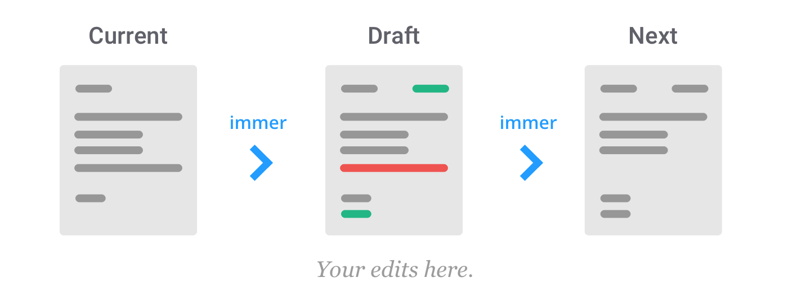

## 代理(Proxy)与反射(Reflect)  

### 1. 基本概念

#### 代理（Proxy）

```
"Proxy 用于修改某些操作的默认行为，等同于在语言层面做出修改，所以属于一种“元编程”（meta programming），即对编程语言进行编程。"—————————— 《ES6 入门·阮一峰》
元编程  是一种编程技术，编写出来的计算机程序能够将其他程序作为数据来处理。意味着可以编写出这样的程序：它能够读取、生成、分析或者转换其它程序，甚至在运行时修改程序自身。
```

代理 （`Proxy`） 按照字面意思理解即可，跟设计模式中的代理模式相似，可以理解成在目标对象之前创建了一个代理的对象，所有外界对目标对象的访问和操作，都会经过这个代理对象进行拦截，控制甚至改写。

```ts
const proxy = new Proxy({}, {
  get(target, prop, receiver) {
    	return 'No Value';
  }
});
console.log(proxy.name);		// 'No Value'
console.log(proxy.age);			// 'No Value'
console.log(proxy.prop);		// 'No Value'
```

#### 反射（Reflect）

`Reflect` 对象和 `Proxy` 对象一样，也是 ES6 为了操作对象而提供的新的 API。设计目的有如下几个：

1. 对明显属于语言内部的语法进行统一的整合（`Object.defineProperty`等），以后的新语法也会在 `Reflect` 对象上添加。
2. 统一返回值以及校验规则，比如返回 成功 `true` 失败 `false`，当输入的值不符合规则时会报错。
3. 整合操作，命令式 => 函数式。如 `in => Reflect.has()`，`delete => Reflect.deleteProperty()`。
4. 与 `Proxy API` 一一对应，实现 `元编程` 的配合。

```ts
const obj = { name: 'Shadow Tricker' };
Reflect.deleteProperty(obj, 'name');		// true
console.log(obj);		// {}
```


#### Target

```ts
const proxy = new Proxy(target, handler);
```


`Proxy` 构造函数接受的第一个参数就是 `target` 对象。

`target` 是 **所要代理的目标对象**，在第一个例子里，它就是那个 `{}`。

#### Handler

`Proxy` 构造函数接受的第二个参数是 `handler` 对象，它是一个配置对象，里面用来 **编写对应操作的动作捕获函数**。

比如在第一个例子里，`handler` 中提供了对访问操作（`get`）的捕获函数，会导致访问所有属性，都返回 `No Value`。

#### Trap

下面是 `Proxy` 支持的捕获函数一览，一共 13 种。
`Reflect` 所提供的方法与 `Proxy` 的方法一一对应，因此不再单独列出。

- `get(target, propKey, receiver)`
- `set(target, propKey, value, receiver)`
- `has(target, propKey)`
- `deleteProperty(target, propKey)`
- `ownKeys(target)`
- `getOwnPropertyDescriptor(target, propKey)`
- `defineProperty(target, propKey, propDesc)`
- `preventExtensions(target)`
- `getPrototypeOf(target)`
- `isExtensible(target)`
- `setPrototypeOf(target, proto)`
- `apply(target, object, args)`
- `construct(target, args)`

1. target： 目标对象本身。
2. propKey： 捕获到的对象的属性名。
3. receiver：代理实例本身。
4. value：捕获到的要设置的值。
5. propDesc：捕获到的要设置的属性描述对象。
6. proto：捕获到的要设置的原型对象。
7. object: 函数执行时，捕获到的要绑定的对象。
8. args： 捕获到的函数执行时，要设置的函数参数。

### 2. 实例应用

#### 1. 使用代理实现输出记录，隐藏属性，只读和属性验证等功能

```ts
function createLogProxy(obj) {
  return new Proxy(obj, {
    get(target, key) {
      console.log(`Data[${ key }] get!`);
      return Reflect.get(target, key);
    },
    set(target, key, value) {
      console.log(`Data[${ key }] has changed!`);
      return Reflect.set(target, key, value);
    }
  });
}
```

如上，在通过代理对象访问属性时，首先会被 `handler` 中的 `get` 方法捕获，然后进行打印 `log` 的操作，`key` 则为通过代理想要访问的属性名称。然后通过 `Reflect` 提供的 `get` 方法，取得当前目标对象中的值返回。

`set` 的捕获方法同理，唯一的区别是  `set` 捕获方法需要返回 `boolean` 类型。在严格模式下，如果返回的不是布尔值，则会报错。

而 `Reflect.set()` 方法正好返回 `boolean` 类型，当然也可以像下面这种写法：

```ts
set(target, key, value) {
  console.log(`Data[${ key }] has changed!`);
  target[key] = value;
  return true;
}
```

不过如开篇所述，`Reflect API` 本身的设计目的之一就是要跟 `Proxy API` 配合使用的，所以比较推荐第一种写法。


```ts
function createHiddenProxy(obj, keysExclude) {
  return new Proxy(obj, {
    get(target, key) {
      if (keysExclude.includes(key)) {
        return `There is no property named [${ key }]!`;
      }
      return Reflect.get(...arguments);
    }
  });
}
```


```ts
function createValidationProxy(obj, validationMap) {
  return new Proxy(obj, {
    set(target, key, value) {
      const valid = validationMap[key] ? validationMap[key](value) : null;
      if (typeof valid === 'boolean') {
        return valid;
      }
      return Reflect.set(target, key, value);
    }
  });
}
```

上述代码大体上就是对 `Proxy` 进行了函数封装，之后返回一个  `Proxy` 实例，实例本身依旧可以作为代理的目标对象进行二次代理，所以可以根据需求进行不同的组合，比如：

```ts
const hiddenProxy = createHiddenProxy(user, ['job']);
const loggerProxy = createLogProxy(hiddenProxy);
const validProxy = createValidationProxy(loggerProxy, {
  name: v => true,
  age: v => {
    if (typeof v !== 'number') {
      // return false;
      throw TypeError(`Age must set a number!`);
    }
    return null;
  }
});
```

如上代码，代码最终调用后，如果封装代理时有副作用，要注意函数的执行顺序，不同顺序执行结果可能是不一样的。

#### 2. 使用代理实现属性自动填充功能

```ts
function createAutoFillObject() {
  return new Proxy({}, {
    get(target, key) {
      if (!Reflect.has(target, key)) {
        Reflect.set(target, key, createAutoFillObject());
      }
      return Reflect.get(target, key);
    }
  });
}

const obj = createAutoFillObject();

obj.test1.test2.test3 = 123;
console.log(obj);
obj.test1.test2.test3 = 456;
console.log(obj);
```

按照普通对象的赋值操作， 在为 `obj` 对象进行上例中的深层次属性赋值时，会因为找不到 `obj.test1` 对象而发生无法为 `undefined` 赋值的报错。但是如上代码，在使用 `Proxy` 进行封装后，相当于每次触发 `get` 捕获都会为该层级设置一个新的代理，这样不管多深的层级，都能一层一层的创建下去（可以理解成用代理实现了递归），改变了数据的结构，使这种深层级属性填充成为了可能。

```ts
function changeObjVal (obj, keysStr, value) {
  const keys = keysStr.split('.');
  function test(o, kArray, val) {
    if (kArray.length === 1) {
      o[kArray[0]] = val;
      return;
    };
    if (!(kArray[0] in o)) {
      o[kArray[0]] = {};
    }
    test(o[kArray[0]], kArray.slice(1), val);
  }
  test(obj, keys, value);
}

const obj = {};
changeObjVal(obj, 'test1.test2.test3', 123);
console.log(obj);
```

如果不使用代理实现的话，就会使用如上代码的解决方式，通过递归和引用传递的方式编写一个函数，然后通过函数去生成特定的结构。相对比而言，`Proxy` 的实现方式使用起来更贴近编程语言本身（元编程的目的），看起来也更直观；而使用递归的方式虽然看起来不直观，但是在性能方面可能更好（大数据量时 `Proxy` 的创建和响应都十分耗性能）。

#### 3. 实现数组负数索引

```ts

function createNegativeArray(array) {
  if (!Array.isArray(array)) {
    throw new TypeError('Expected an array');
  }

  return new Proxy(array, {
    get(target, index) {
      const idx = +index;
      let i = idx < 0 ? target.length + idx : idx;
      return Reflect.get(target, i);
    },
    set(target, index, val) {
      const idx = +index;
      let i = idx < 0 ? target.length + idx : idx;
      return Reflect.set(target, i, val);
    }
  });
}

const array = Array.from({ length: 3 }, (v, i) => (i + ''));
const negaArray = createNegativeArray(array);
negaArray[-3] = '123';
```

上例非常简单，就是对数组的 `index` 进行正负校验来判断是否需要跟数组的长度进行加法运算。

### 3. Immer.js

#### 1. Immer 的基本概念

`Immer.js` 是用来生成 `不可变数据（Immutable Data）`。与主流的 `Immutable.js` 生成不可变对象的方式不同（`Immutable.js` 是**通过算法优化**来生成不可变对象），`Immer` 主要是通过代理（`Proxy API`）这种 `Javascript` 新语言特性来生成不可变对象的。

`Immer` 的出现，主要是为了解决以下两点问题：

- 1. 对于状态管理的深层次更新，增加修改状态的可读性以及可维护性。举个例子：
```ts
const state = {
  name: 'Shadow',
  age: 30,
  address: {
    street: 'Yulin Street',
    suite: 'No.28',
    city: 'Dalian',
    zipcode: '116030',
    detail: {
      unit: '6',
      numbr: '3'
    }
  }
};

this.store.update(state => ({
  ...state,
  address: {
    ...state.address,
    zipcode: '111111',
    detail: {
      ...state.address.detail,
      unit: '3'
    }
  }
}));
```

在日常开发的时候肯定会遇到状态管理，其对应的解决方式大体上都是类似于 `redux` 合并状态数据的流程，通过扩展运算符，对旧数据进行浅拷贝，同时使用新属性覆盖需要替换的旧属性。如上代码所示，维护状态的代码会因为书写一堆固定的扩展模板而非常不清晰。

```ts
this.store.update(state => {
  state.address.zipcode = '111111',
  state.address.detail.unit = '3';
});
```


- 2. 解决状态的共享问题（没做改变的属性，不会变）

其实，如果单纯的为了解决第一个问题，也可以使用深拷贝的方法，克隆出一份状态的副本，然后在副本上对属性进行修改，返回这个副本，如下：

```ts
const stateCopy = cloneSimple(stateObj);
stateCopy.address.zipcode = '111111',
stateCopy.address.detail.unit = '3';
console.log(stateCopy);
console.log(stateObj);
console.assert(stateCopy.hobbies !== stateObj.hobbies, 'Not Equal');
```

但是使用这种方式有一个问题，首先是对不变的对象进行复制浪费了性能；其次是哪怕复制后的对象本身没有改变，但是它的内存却被重新赋值，导致不该变化的组件更新渲染。

`immer` 解决这个问题的方式是，它只会改变需要改变的节点，而不改变其它的节点，如下图：


#### 2. Immer 的实现原理

##### 1. 工作原理

`Immer` 的工作原理本身很简单。

- 1. 对传入的当前 `State` 进行代理（`Current State`）。
- 2. 以生成的代理对象作为草稿（`Draft State`），执行修改操作。
- 3. 通过草稿的修改记录，产生新的 `State` 对象（`Next State`）。

如下图：



##### 2. 实现原理

实现的原理有两个关键点： **1). Copy On Write（CoW）2). Proxy**

这里只介绍一下第一点，直译的意思为 “写时复制”，可以理解为，在读取时生成副本，副本内值的内存引用与原始资源一致（资源共享）；当副本需要进行修改时，才进行分配新内存地址的复制操作。

按照这个理论，来实现第一版的代码：

```ts
// produce function 1st version
function produceFn(baseState, updateFn) {
  let copy;
  const handler = {
    set(target, prop, value) {
      if (!copy && target[prop] !== value) {
        console.log(prop);
        copy = shallowCopy(target);
      }
      return Reflect.set(copy, prop, value);
    }
  };

  const proxy = new Proxy(baseState, handler);
  updateFn(proxy);
  return copy;
}
```

跟 `immer` 的 `produceFn` 一样，它接收两个参数：当前的 `state` 值，以及用来更新的函数。

当 `state` 中的字段需要修改时，对 `state` 进行浅拷贝，然后在 `copy` 的副本上，进行值修改，然后返回修改后的副本。

但是执行时发现，`set` 捕获方法只捕获了第一层的状态变更，而深层次的状态变更它并没有拦截到。并且子属性如果更新了，那么对应这条链上的值都应该处于更新的状态。

```ts
const state = {
  name: {
    firstName: 'Shadow',
    lastName: 'Tricker'
  },
  phone: {
    mobile: '123-1234-1234',
    fix: '8888-8888'
  },
  age: 30,
  test: '111111'
};

const newState = produceFn(state, draft => {
  draft.age = 28;
  draft.test = '2222';
  draft.name.lastName = '3333';
});
console.log(newState);
console.log(newState.name === state.name);			// true
console.log(newState.phone === state.phone);		// true
```

解决问题的方式与前面提到的深层次填充属性相类似的，如果希望每一层的 `set` 捕获方法都能捕获到对应层级的状态变更，就需要对应层级返回的对象本身就是一个代理对象。如图：


比如，要修改 `state.a.b` 的值：

- 首先取得 `state` 的 代理 `state'`
- 取得 `state'.a` 的代理 `a'`，这样才能保证，当修改 `b` 的值得时候，`a'` 会对修改行为进行拦截
- 修改 `b` 的值

基于上面，来实现第二版代码：

```ts
// produce function 2nd version
function produceFn(baseState, updateFn) {
  const copies = new Map();
  const handler = {
    get(target, prop) {
      return new Proxy(target[prop], handler);
    },
    set(target, prop, value) {
      if (target[prop] !== value) {
        console.log(prop);
        const copy = shallowCopy(target);
        copy[prop] = value;
        copies.set(target, copy);
      }
      return true;
    }
  };

  function finalize(state) {
    const result = copies.get(state);
    Object.keys(state).forEach(k => {
      const copy = copies.get(state[k]);
      if (copy) {
        result[k] = copy;
      }
    });
    return result;
  }

  const proxy = new Proxy(baseState, handler);
  updateFn(proxy);
  return finalize(baseState);
}
```

与第一版有如下几处不同：

1. 添加了一个 `copies Map` 对象，用来存储所有被修改过的副本。
2. 增加了一个 `get` 捕获方法，该方法对于所有的 `get` 访问，都会返回对应属性的代理（即 `a'`）。
3. 这样，当 代理（`a'`）被修改时， `set` 捕获方法被触发，生成修改后的副本，存储到 `Map` 中。
4. 最后，编写一个 `finalize` 函数，对属性进行遍历，如果从 `Map` 中取到 `copy`，则代表该字段被修改过，那么使用 `copy` 生成新的状态；取不到 `copy`，则没发生变化，不做任何操作。

到此，`immer` 的实现原理基本就介绍完了，总结一下，大概有以下几点：

- 根据 `base state` 创建代理对象
- 执行用户对代理对象的修改
- 执行修改时，每一层级的代理都对修改操作进行捕获，然后统一集合在缓存的 `map` 中
- 最后，执行递归和遍历，对每一层级的变更进行整合，然后返回新的状态对象

下面贴一下 `immer` 最初版本的代码（现在已经更新很多次，并且越来越复杂，感兴趣自行了解），就是在第二版的基础上，添加了删除，校验以及递归深层次等操作：

```ts
function produceFn(baseState, updateFn) {
  // Maps baseState objects to proxies
  const proxies = new Map()
  // Maps baseState objects to their copies
  const copies = new Map()

  const handler = {
      get(target, prop) {
          return createProxy(getCurrentSource(target)[prop])
      },
      has(target, prop) {
          return prop in getCurrentSource(target)
      },
      ownKeys(target) {
          return Reflect.ownKeys(getCurrentSource(target))
      },
      set(target, prop, value) {
          const current = createProxy(getCurrentSource(target)[prop])
          const newValue = createProxy(value)
          if (current !== newValue) {
              const copy = getOrCreateCopy(target)
              copy[prop] = newValue
          }
          return true
      },
      deleteProperty(target, property) {
          const copy = getOrCreateCopy(target)
          delete copy[property]
          return true
      }
  }

  // creates a copy for a base object if there ain't one
  function getOrCreateCopy(base) {
      let copy = copies.get(base)
      if (!copy) {
          copy = Array.isArray(base) ? base.slice() : shallowCopy(base)
          copies.set(base, copy)
      }
      return copy
  }

  // returns the current source of trugth for a base object
  function getCurrentSource(base) {
      const copy = copies.get(base)
      return copy || base
  }

  // creates a proxy for plain objects / arrays
  function createProxy(base) {
      if (isPlainObject(base) || Array.isArray(base)) {
          if (proxies.has(base)) return proxies.get(base)
          const proxy = new Proxy(base, handler)
          proxies.set(base, proxy)
          return proxy
      }
      return base
  }

  // checks if the given base object has modifications, either because it is modified, or
  // because one of it's children is
  function hasChanges(base) {
      const proxy = proxies.get(base)
      if (!proxy) return false // nobody did read this object
      if (copies.has(base)) return true // a copy was created, so there are changes
      // look deeper
      const keys = Object.keys(base)
      for (let i = 0; i < keys.length; i++) {
          if (hasChanges(base[keys[i]])) return true
      }
      return false
  }

  // given a base object, returns it if unmodified, or return the changed cloned if modified
  function finalize(base) {
      if (isPlainObject(base)) return finalizeObject(base)
      if (Array.isArray(base)) return finalizeArray(base)
      return base
  }

  function finalizeObject(thing) {
      if (!hasChanges(thing)) return thing
      const copy = getOrCreateCopy(thing)
      Object.keys(copy).forEach(prop => {
          copy[prop] = finalize(copy[prop])
      })
      return copy
  }

  function finalizeArray(thing) {
      if (!hasChanges(thing)) return thing
      const copy = getOrCreateCopy(thing)
      copy.forEach((value, index) => {
          copy[index] = finalize(copy[index])
      })
      return copy
  }

  // create proxy for root
  const rootClone = createProxy(baseState)
  // execute the thunk
  updateFn(rootClone)
  // and finalize the modified proxy
  return finalize(baseState)
}

function isPlainObject(value) {
  if (value === null || typeof value !== "object") return false
  const proto = Object.getPrototypeOf(value)
  return proto === Object.prototype || proto === null
}

```

### 4. 总结

`Proxy API` 和 `Reflect API` 功能很强大，但是在平时工作中一般很难有应用的场景（除非就是要监听某些对象字段的变化等）。不过从主流的应用库来看，像 `Vue` 使用其生成响应数据来实现双向绑定，`Immer` 生产不可变数据等等，如果工作的目标一开始就是开发一些实用的工具或者库，那么代理与反射可能是有很大帮助和作用的新语言特性之一。
